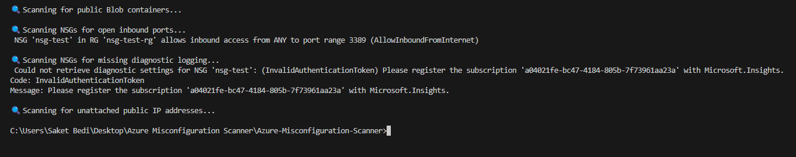

# Azure-Misconfiguration-Scanner
Python script to detect common Azure security misconfigurations.

#  Azure Misconfiguration Scanner

##  Objective
Scan Azure environments for common security misconfigurations using Python and Azure SDKs.

##  What It Detects
- Public Blob containers (T1530)
- Open inbound ports in NSGs (T1046)
- NSGs missing diagnostic logging (T1082, T1562)
- Unattached Public IPs (T1580)
- Storage accounts without firewall rules (T1530)

## Additional Identity Check

This project also includes a manual MFA misconfiguration check using Azure CLI. See `mfa_check.md` for details.

## MITRE ATT&CK Mapping

This tool aligns detection logic with MITRE ATT&CK techniques.  
See [mitre_mapping.md](mitre_mapping.md) for details.

##  How to Run
```bash
pip install -r requirements.txt
az login
python azure_misconfig_scanner.py

## Sample Scan Output

The scanner outputs live detection of misconfigurations in your Azure environment:


